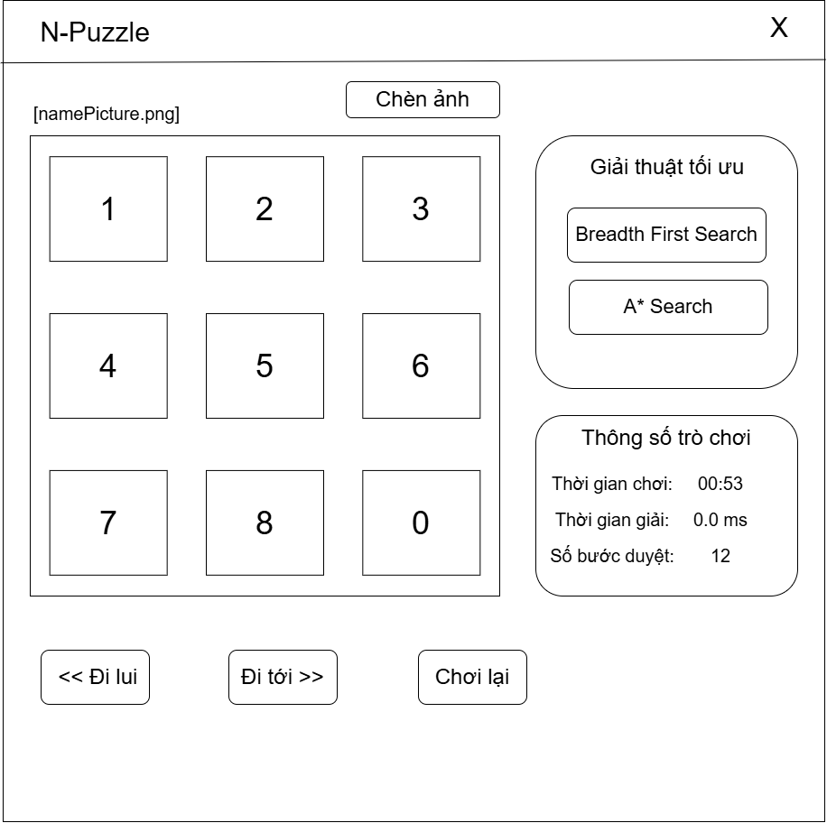

# BẢN ĐẶC TẢ YÊU CẦU DỰ ÁN CUỐI KÌ - MÔN TRÍ TUỆ NHÂN TẠO

## 1. Thông tin chung

- **Tên đề tài**: Nghiên cứu Heuristic và Blind Search, ứng dụng và so sánh 2 thuật toán tìm kiếm (Breadth-First Search, A\* Search) trong việc giải quyết trò chơi ghép hình 8 ô (8-Puzzle Game). Hiển thị thông số cho mỗi thuật toán tìm kiếm được, thêm các tính năng phụ cho phép user chèn ảnh, sử dụng stack để quản lý các bước đi redo/undo.
- **Nhóm thực hiện**: Nhóm 4 (5 Thành viên)
- **Hạn chót (Deadline)**: 24/04/2026
- **Công nghệ sử dụng**:
  - **Ngôn ngữ**: Python 3.13
  - **Thư viện đồ họa**: Pygame
  - **Tiêu chuẩn lập trình**: OOP, SOLID, Design Patterns.
  - **Phương pháp**: Phát triển nhanh với sự hỗ trợ của AI Agent.

---

## 2. Mục tiêu đề tài

Nghiên cứu và triển khai 2 thuật toán tìm kiếm tiêu biểu (BFS và A\*) để giải quyết bài toán 8-Puzzle. So sánh hiệu năng giữa thuật toán tìm kiếm mù và tìm kiếm có tri thức dựa trên các tiêu chí: thời gian thực thi (ms) và số lượng nút (states) đã duyệt. Đồng thời, xây dựng một ứng dụng có giao diện hiện đại, hỗ trợ tùy biến hình ảnh và quản lý lịch sử bước đi (Undo/Redo).

---

## 3. Danh sách các thuật toán triển khai

Dự án tập trung vào việc nghiên cứu và so sánh 2 thuật toán chính:

1.  **Breadth-First Search (BFS)**: Đại diện cho nhóm tìm kiếm mù (Blind Search). Thuật toán duyệt qua tất cả các nút ở độ sâu hiện tại trước khi chuyển sang độ sâu tiếp theo, đảm bảo tìm ra lời giải ngắn nhất.
2.  **A\* Search**: Đại diện cho nhóm tìm kiếm có tri thức (Heuristic Search). Sử dụng hàm mục tiêu $f(n) = g(n) + h(n)$ để định hướng tìm kiếm hiệu quả hơn.
    - _Các hàm Heuristic dự kiến_: Manhattan Distance, Hamming Distance.

---

## 4. Đặc tả chức năng (Functional Requirements)

### 4.1. Quản lý Trò chơi

- **Khởi tạo**: Tạo trạng thái ngẫu nhiên (có thể giải được) của bàn cờ 3x3.
- **Giải bài toán**: Người dùng chọn thuật toán và nhấn "Solve", hệ thống sẽ hiển thị các bước di chuyển tự động để về trạng thái đích.
- **Trạng thái đích (Goal State)**:
  ```
  1 2 3
  4 5 6
  7 8 0 (ô trống)
  ```

### 4.2. Xử lý hình ảnh và Tiện ích

- **Tùy biến hình ảnh**:
  - Cho phép người dùng tải lên ảnh bất kỳ (.jpg, .png) hoặc sử dụng ảnh mặc định.
  - Hệ thống tự động cắt và gán hình ảnh vào các ô (tiles) 3x3.
- **Quản lý bước đi (Undo/Redo)**:
  - Sử dụng cấu trúc dữ liệu **Stack** để lưu trữ lịch sử các trạng thái.
  - Cho phép người dùng quay lại bước trước đó hoặc đi tới bước đã thực hiện.

### 4.3. Đo lường và So sánh

- **Hiển thị thời gian**: Tính toán thời gian thực thi của thuật toán bằng miliseconds (ms).
- **Số bước giải**: Hiển thị tổng số bước cần di chuyển để đạt đích.
- **Bảng so sánh**: Một Dashboard nhỏ thống kê kết quả của các thuật toán khác nhau trên cùng một trạng thái đầu vào.

---

## 5. Yêu cầu phi chức năng (Non-functional Requirements)

- **Giao diện (UI/UX)**:
  - Sử dụng **Pygame** để tạo hiệu ứng di chuyển mảnh ghép mượt mà.
  - Màu sắc hài hòa, bố cục dễ nhìn, trực quan.
- **Kiến trúc phần mềm**:
  - **SOLID**: Đảm bảo code dễ bảo trì và mở rộng.
  - **Design Patterns**: Áp dụng các mẫu thiết kế phổ biến (Strategy, Factory) để cấu trúc code rõ ràng, giúp AI Agent dễ dàng bảo trì và mở rộng.
- **Hiệu năng**: Hệ thống không được treo khi thực hiện các thuật toán phức tạp (sử dụng Multi-threading).

---

## 6. Giao diện dự kiến (Mockup & Wireframe)

Bản thiết kế giao diện (Pygame) đề xuất cho dự án với phong cách hiện đại (Glassmorphism):


_Hình 1: Mockup giao diện hoàn chỉnh với hiệu ứng Neon và bảng điều khiển._


_Hình 2: Khung xương (Wireframe) bố trí các thành phần chức năng._

---

## 7. Phân công công việc (Task Assignment)

Dự án được chia đều cho 5 thành viên với các trách nhiệm cụ thể dựa trên bản thiết kế:

| STT | Thành viên       | Nhiệm vụ chính                      | Công việc chi tiết                                                                      |
| :-- | :--------------- | :---------------------------------- | :-------------------------------------------------------------------------------------- |
| 1   | **Thành viên 1** | **Thuật toán BFS**                  | - Khởi tạo khung project.<br>- Cài đặt thuật toán BFS (Blind Search).                   |
| 2   | **Thành viên 2** | **Quản lý chuyển động & Undo/Redo** | - Xử lý logic di chuyển tiles.<br>- Xây dựng hệ thống Undo/Redo bằng **Stack**.         |
| 3   | **Thành viên 3** | **Xử lý hình ảnh**                  | - Module chèn ảnh người dùng.<br>- Hiệu ứng animation mượt mà khi di chuyển tile.       |
| 4   | **Thành viên 4** | **UI/UX Design**                    | - Thiết kế Layout & Panel điều khiển.<br>- Hiệu ứng Neon/Glow cho giao diện.            |
| 5   | **Thành viên 5** | **Thuật toán A\***                  | - Cài đặt A\* và các hàm Heuristic.<br>- Module Dashboard thống kê & so sánh hiệu năng. |

---

## 8. Quy trình thực hiện dự án

1.  **Giai đoạn 1 (10/04 - 17/04)**: Hoàn thành logic AI, thuật toán tìm kiếm và xử lý hình ảnh.
2.  **Giai đoạn 2 (18/04 - 24/04)**: Tích hợp giao diện Pygame, tối ưu hóa hiệu năng, kiểm thử và đóng gói.
    **Hạn chót nộp dự án: 24/04/2026.**
